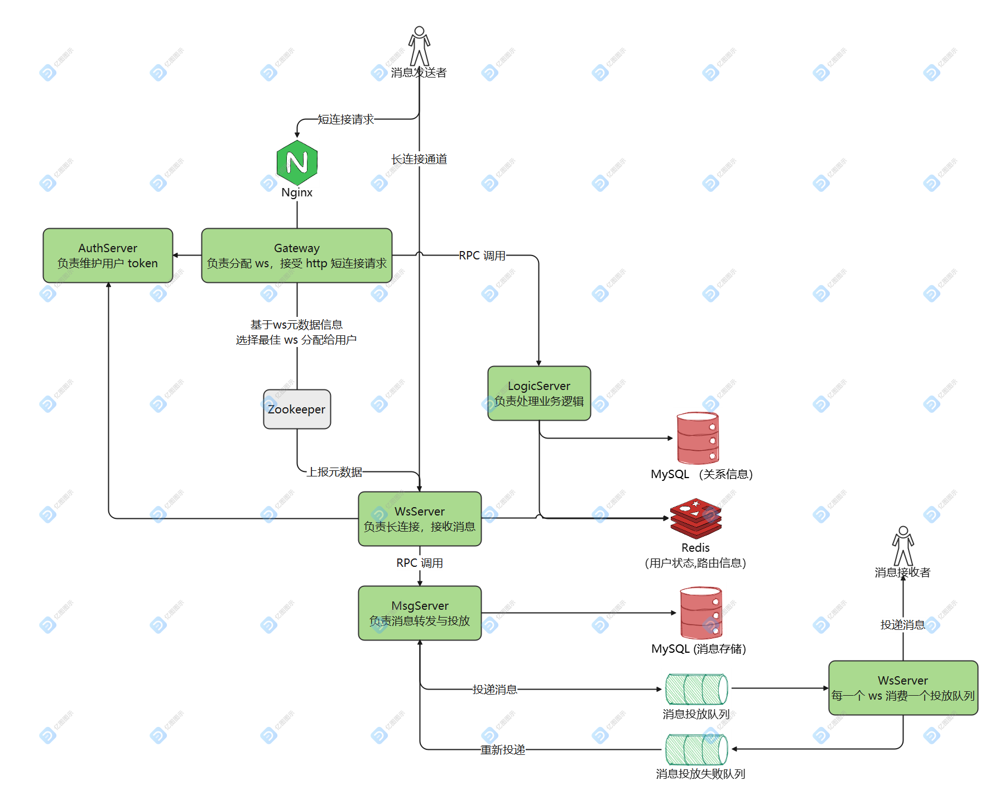

    

    
    
    

# 简介

一个分布式 IM 即时通讯系统。

# 特性

## 功能特性

- [ ] Web 客户端支持
- [x] 群聊、单聊
- [x] 离线消息获取、历史消息获取、消息漫游
- [x] 唯一设备踢出
- [ ] 消息撤回
- [ ] 消息已读
- [ ] 文件、图片、语音发送

## 架构特性

- [x] WebSocket Server 长连接直连
- [x] HTTP 短连接处理业务逻辑
- [x] 灵活的水平扩容、缩容，理论上可无限扩展
- [x] 使用 Dubbo 作为跨节点通信框架
- [x] 使用 Zookeeper 实现 WebSocket Server 的服务注册与发现，实现基于 WebSocket Server 状态的负载均衡选择器
- [x] 使用 Redis 维护用户路由、用户状态信息
- [x] 使用 Nginx 作 Gateway 的反向代理、负载均衡
- [x] 自定义协议配合 Protobuf 实现高扩展性、高性能协议
- [x] 使用 Redis Stream 作为消息中间件
- [ ] 使用 sharding-jdbc 进行分库分表
- [ ] Netty 开发 WebSocket 服务端，实现百万连接
- [ ] 高可靠性、顺序性、重复性消息传输保障
- [ ] 高性能分布式 ID 生成
- [ ] 自动短线重连，心跳检查

# 功能演示

# 项目结构

- auth-server: 认证中心，维护用户 token
- common: 公共模块，包含实体类、工具类、RPC服务接口、常量、Mapper
- gateway: 网关，负责为用户分配 Websocket Server、用户请求鉴权、协议转换
- logic-server: 维护用户状态、处理业务
- msg-server: 消息的转发，保证消息可靠投递
- ws-server: Websocket Server 长连接服务器，负责接收发送用户消息，添加消息序号、时间戳

# 架构图

**所有模块均可水平扩展。**

# 时序图

# 服务部署

使用 Docker-compose 的方式部署，实例部署方案: nginx 1，mysql 1，redis 1，zookeeper 1，auth-server 1，gateway 1，logic-server 1，msg-server
1，ws-server 3。

部署步骤如下：

1. Clone 本项目，调整 docker-compose.yml 配置
2. 父模块执行 `mvn clean install '-Dmaven.test.skip=true'`
3. 在 common 模块执行 `mvn clean install '-Dmaven.test.skip=true'`
4. 在其余的每个模块执行 `mvn clean install package '-Dmaven.test.skip=true'`
5. 执行 docker-compose/mkdirs.sh 脚本创建用于 docker 挂载的文件夹
6. 将打包得到的 jar 包拷贝到 docker-compose/jars 下的相应目录
7. 在 docker-compose 目录下执行 `docker-compose up -d`

# 性能测试
